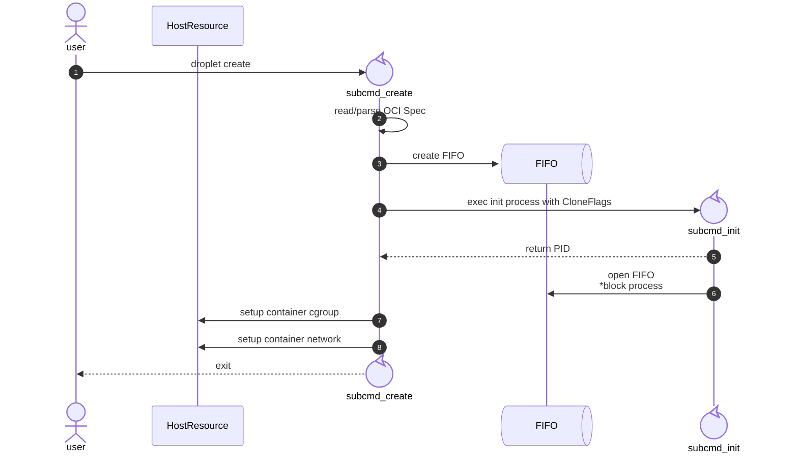
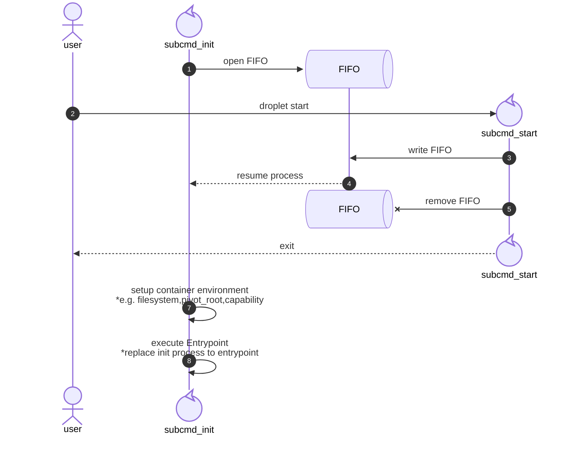

# コンテナ起動の基本シーケンス
コンテナの起動、言い換えるとコンテナとなりうるプロセスの起動は、通常の子プロセス生成(fork)とは異なった処理順で起動します。  
通常の子プロセス生成は親プロセスのリソース制限や名前空間などをそのまま引き継ぎますが、
コンテナプロセスはこれらを隔離し独立したプロセスとして生成する必要があるからです。  
ここではRaindがどのように子プロセスを生成し、生成したプロセスの環境をセットアップしていくかをまとめています。

## 起動シーケンス
Dropletでは、createとstartの2フェーズでコンテナプロセスを起動しています。

### createフェーズ (create+init起動)


createフェーズでポイントとなるのは以下です。

- 起動シーケンス同期用FIFOを作成
- OCI Specに基づき、名前空間やUID/GID Mappingを行ったinitプロセスを起動
- initプロセス作成後、ホスト側でcgroupやveth等のセットアップを行う
- これらが完了したら、initプロセスを待たずに終了

initプロセスと呼ばれるコンテナの元となるプロセスの起動、
ホスト側でのみ可能な範囲のセットアップを行った後、createコマンド自体は終了します。

作成されたinitプロセスは、即座に同期用のFIFOを開きます。
FIFO=名前付きパイプは、開いた側はFIFOに対して何らかのデータが書き込まれるまで処理を止める動作があり、
これを利用することでホスト側のセットアップが完了する前にinitプロセスが走ることを防ぎます。  
この起動フローをraindでは **create+initモデル** と呼んでいます。

### startフェーズ

startフェーズでは、

- FIFOに対してiniプロセス開始シグナルを送信
- initプロセス内でコンテナ環境の最終セットアップを行った後、Entrypointを実行

という流れになります。

FIFOへ書き込む開始シグナルはSIGTERMやSIGINTといったものではなく、1バイト書き込みを行っています。  
FIFOへデータが書き込まれ処理を再開したinitプロセスは、hostname変更やfilesystmeの構築、pivot_rootによるファイルシステム隔離等々の最終セットアップを行い、最後にOCI Specで指定されたEntrypointを実行します。

## 実動作
実際の動作を見ていきます。  
本来はOCI Specの準備やBundleの準備等が必要ですが、ここでは省略して起動時のinitプロセスに着目します。  
テストで利用するOCI Specに定義されているEntrypointは以下です。
```json
"process": {
    "args": [
        "/bin/sh",
        "-c",
        "echo hello; sleep 3600"
    ],
}
```

### createフェーズ
raindのサブコマンド:createを実行し、initプロセスを起動します。
```bash
$ raind container createt 01kf2a3a1tbc

$ ps -fp 90190
UID          PID    PPID  C STIME TTY          TIME CMD
root       90190       1  0 11:29 pts/7    00:00:00 droplet init 01kf2a3a1tbc /etc/raind/container/01kf2a3a1tbc/exec.fifo /bin/sh -c echo hello; sleep 360
```
起動したinitプロセスを確認してみると、CMDが `droplet init ...` となっています。  
これはdropletにはinitプロセス用としてinitサブコマンドを実装しており、オプションでFIFOパスやentrypointを渡す設計としています。  
このFIFOパスを確認してみます。
```bash
$ ls -l /etc/raind/container/01kf2a3a1tbc/
total 28
-rw-r--r-- 1 root root 6633 Jan 16 11:43 config.json
drwxr-xr-x 2 root root 4096 Jan 16 11:43 diff
drwxr-xr-x 2 root root 4096 Jan 16 11:43 etc
prw------- 1 root root    0 Jan 16 11:43 exec.fifo
drwxr-xr-x 2 root root 4096 Jan 16 11:43 merged
-rw-r--r-- 1 root root  768 Jan 16 11:43 state.json
drwxr-xr-x 2 root root 4096 Jan 16 11:43 work
```
OCI Spec(config.json)やステータス情報(state.json)等もありますが、`exec.fifo`が名前付きパイプです。  
initプロセスはこのexec.fifoを開き、開始シグナル待機状態となっています。

### startフェーズ
raindのサブコマンド:startを実行し、initプロセスへ開始シグナルを送信します。
```bash
$ raind container start 01kf2a3a1tbc

$ ps -fp 90190
UID          PID    PPID  C STIME TTY          TIME CMD
root       90190       1  0 11:29 pts/7    00:00:00 /bin/sh -c echo hello; sleep 3600
root       90684   90190  0 11:32 pts/7    00:00:00 sleep 3600
```
再度initプロセスを確認すると、CMDが `droplet init ...` から、 `/bin/sh -c ...` に変わっています。これはOCI Specで指定したEntrypointです。  
また、sleepコマンドはentrypointの子プロセスとして起動していることも確認できます。

### コンテナ内プロセス確認
せっかくなのでコンテナ内のプロセスも確認してみます。  
raindのサブコマンド:execを実行し、コンテナ内のプロセス情報を見てみます。
```bash
$ raind container exec -t 01kf2a3a1tbc /bin/bash
root@01kf2a3a1tbc:/# ps -ef
UID        PID  PPID  C STIME TTY          TIME CMD
root         1     0  0 02:29 ?        00:00:00 /bin/sh -c echo hello; sleep 3600
root         7     1  0 02:32 ?        00:00:00 sleep 3600
root         8     0  0 02:37 ?        00:00:00 /bin/bash
root        11     8  0 02:38 ?        00:00:00 ps -ef
```
ホスト上でPID:90190だったものが、コンテナ内ではPID:1になっています。  
これでinitプロセスが単なるプロセスではなく、コンテナプロセスとして起動できていることが確認できました。
