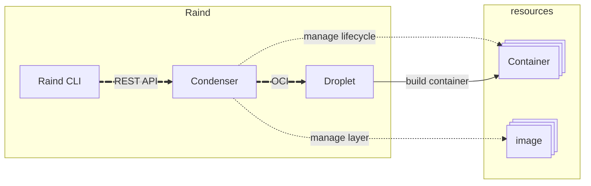

# Raindコンテナランタイムスタック
Raindは3つのコンポーネントで構成されたコンテナランタイムスタックの総称です。  

- **Raind CLI**: Raindコンテナランタイムスタックの操作を提供するCLIツール
- **Condenser**: コンテナライフサイクル管理/イメージ管理を行う高レベルコンテナランタイム
- **Droplet**: コンテナの作成/起動/停止を行う低レベルコンテナランタイム

## Raind CLI
Raindコンテナランタイムスタックを操作するためのCLIツール。  
高レベルコンテナランタイムはREST APIをインターフェースとしているため、  
コマンドラインのパースおよびAPIリクエストを行う。

## Condenser
コンテナライフサイクルおよびイメージ管理を行う高レベルコンテナランタイム。  
コンテナの起動に伴うホストリソースのセットアップ、コンテナ設定構築、イメージ取得等の低レベルコンテナランタイムによるコンテナ起動のための環境整備を行う。  
また、起動しているコンテナの死活監視等によるライフサイクル管理も併せて担う。  
(repository: https://github.com/pyxgun/Condenser)

## Droplet
起動/停止/削除を行う低レベルコンテナランタイム。  
高レベルコンテナランタイムによって用意された環境を利用し、コンテナを実際に構築する役割を担う。  
DropletはOCI準拠のインターフェースを備えたバイナリファイルとして設計しており、
高レベルコンテナランタイムから実行される。  
(repository: https://github.com/pyxgun/Droplet)