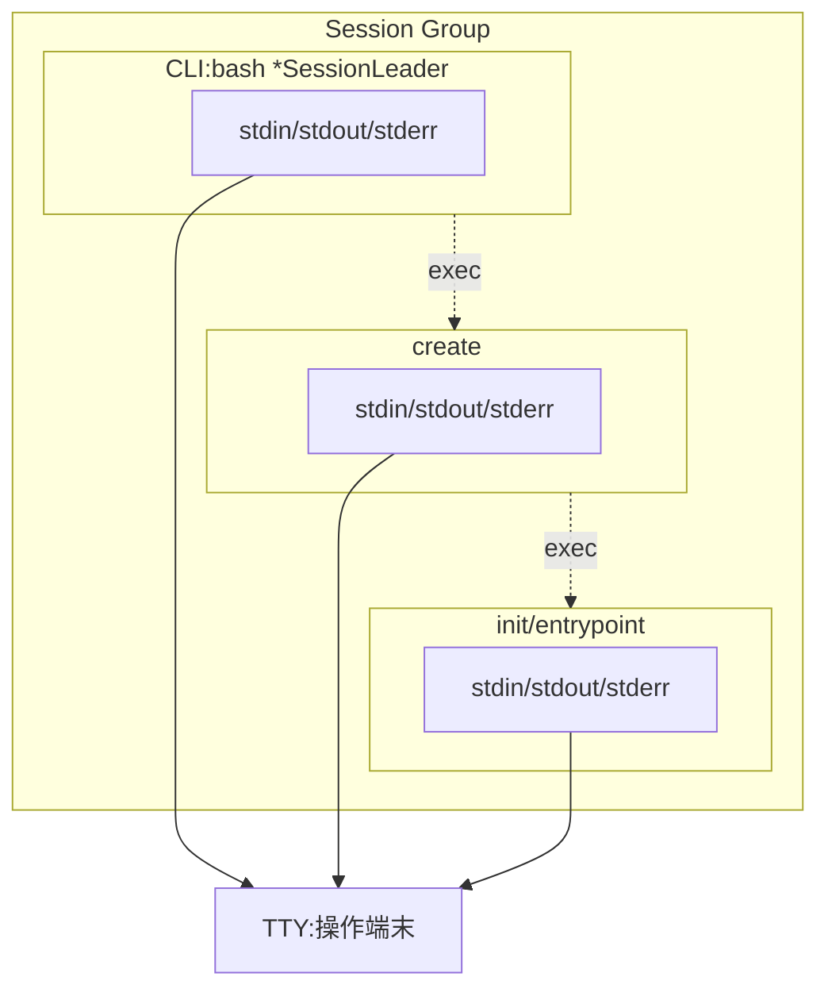
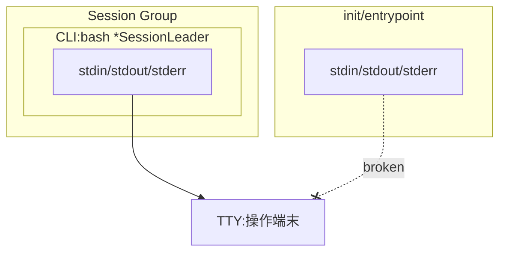
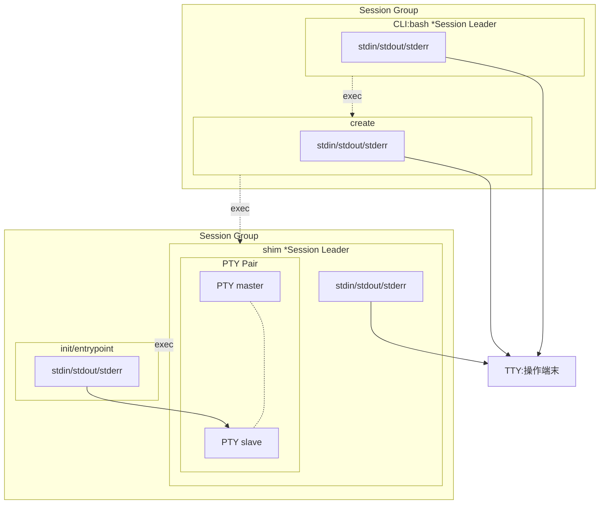
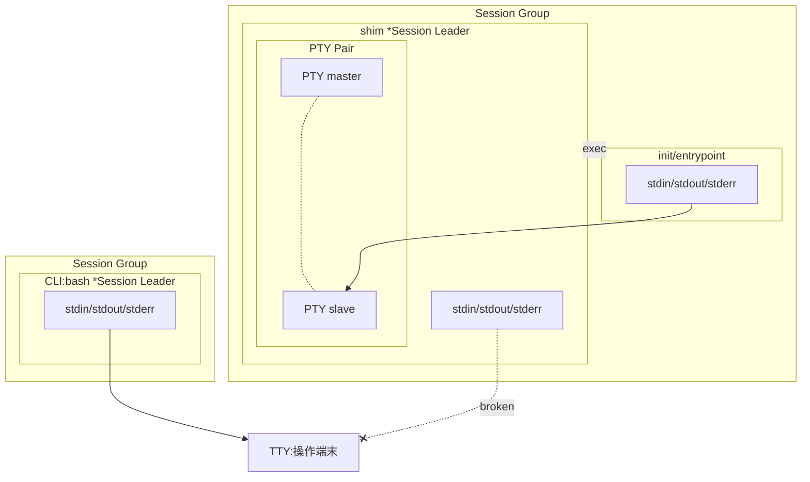
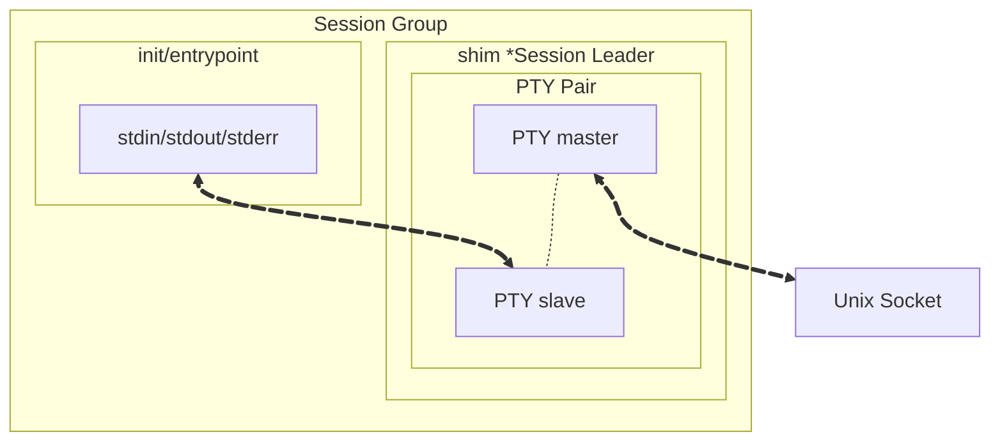
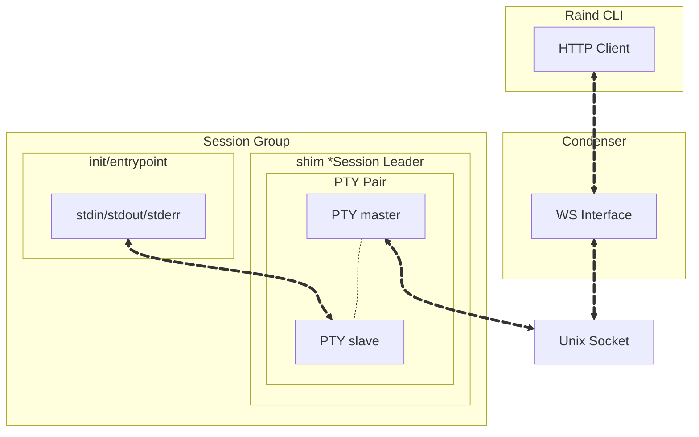
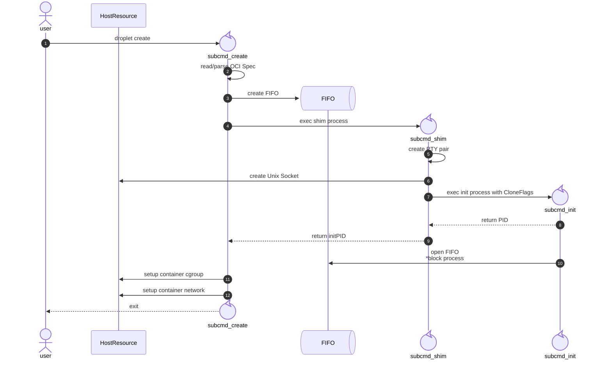

**目次**
* TOC
{:toc}

---

## 対話形式でのコンテナ起動
[コンテナ起動シーケンス#1 create+initモデル]({{ '/_posts/container_startup_sequence_1' | relative_url }})で紹介したシーケンス(create+init起動)は、バックグラウンドコンテナ専用のフローです。  
/bin/bash起動によるコンテナ内操作や操作ターミナル上にログを表示させながらのリアルタイム確認といった、いわゆる対話形式での起動は別のフローになります。  
ここではRaindにおける対話形式でのコンテナ起動についてまとめています。

### create+init起動におけるTTY問題
前回紹介したバックグラウンドでは、対話形式でのコンテナ起動ができません。  
具体的に例を挙げると、/bin/bashをエントリポイントとして持つコンテナは起動直後に即時終了します。  
これはプロセスが接続しているTTYの状況を整理することで理解できます。

#### create+initモデル: 起動時

create+initモデルのプロセスとTTYはこのようになっています。  
/bin/bashで操作している前提とした場合、/bin/bashのプロセスがTTYにおけるSession Leaderです。  
このbashからcreateプロセス(コマンド)を実行した場合、子プロセスのstdin/out/errは親プロセスのfdをそのまま継承します。つまり、bashと同様のTTYに繋がります。(bash内でbashを起動しても操作できる理屈もここにあります。)  
createプロセス内でinitプロセス(コマンド)を実行しますが、ここも同様に親プロセスからfdを継承します。initプロセスにとっての親プロセスのfdはbashと同様のTTYなので、ここで登場している3つのプロセスは全て同一のTTYに繋がっています。  
ここまでの状況であれば、initプロセス=コンテナプロセスに対してもbashからの操作が届く状況です。

#### create+initモデル: createプロセス終了時
前回紹介したとおり、createプロセスは必要なセットアップが終了した後、initプロセスの終了を待たずにCloseします。  
このときのプロセスとTTYの状況は次のようになります。  



createプロセスが終了すると、initプロセスは親プロセスが不在になりPPID=1になると同時に、**Session Group**からも外れます。SessionGroupから外れた結果、**fdはTTYを参照しているが、TTYとの関係性が壊れ、TTYが利用できなくなる** という状況に陥ります。initプロセスが宙ぶらりんになってしまうのです。  
(たまにコンテナプロセスのTTY接続が切断される、という表現を見ますが、"接続しているが利用できない"の方が正しい表現です)  
bashがエントリポイントの場合、bashは起動時にプロセスのstdinを開き入力待ちに入りますが、この状況ではstdinのfdであるTTYとの関係性が壊れているためstdinを開くことができず、EOF判定となり即時終了してしまう、というわけです。  

### create+shim+initモデル
この問題を解消するために、Raindでは create+**shim**+initモデルを用意しています。  
図に表すと次のようになります。



create+initモデルとの差分は次の通りです。

- createプロセスは**shimプロセス**を起動
- shimプロセスが**initプロセス**を起動
- shimプロセスが**新たにSession Leaderとなる**
- shimプロセスが**PTY Pair**(master/slave)を作成
- initプロセスは**PTY slaveがstdin/out/errの接続先**となる

このモデルにした場合、createプロセスが終了した場合の動作が変わります。

#### create+shim+initモデル: createプロセス終了時


createプロセスが終了した場合、その子プロセスであるshimプロセスのstdin/out/errは先ほどと同様TTYとの関係性が壊れます。  
しかし、initプロセスはPTY slaveを参照しており、shimプロセス自体はcreateプロセスが終了した後も生き続けるため、initプロセスとしてのstdin/out/errの接続性は保たれたままになります。  
この結果、bash等を起動してもstdinを正しく開くことができ、即時終了せずに起動し続けることができます。  

このような

- PTY Pairの作成
- initプロセスのPTY slave接続

を**PTY接続(疑似端末)**とよび、Dockerでは `-t` オプションを指定してこのような操作をしています。  
以降はcreate+shim+initモデルで起動したコンテナを **PTY接続コンテナ** と呼ぶことにします。

### PTY接続コンテナまでの導線
PTY接続によりinitプロセスが生き続ける、つまり延命することはできるようになりましたが、このままでは図からもわかる通りTTYまでの接続経路はありません。  
ここからはPTY接続を行ったinitプロセス(=コンテナ)までの導線について紹介します。  

#### 1. Unix Socket
TTYまでの接続経路の一つとして、まずはUnix Socketを利用します。



shimプロセスはPTY Pairの作成と併せて、Unix Socketを作成します。  
その後、shimプロセスはUnix SocketとPTY masterのデータ中継処理を行う処理に入ります。

#### 2. Web Socket
RaindではCondenser(高レベルコンテナランタイム)をデーモンとして起動しているため、Unix Socketへの接続はCondenserが担います。そのうえで、ユーザはRaind CLIを使いCondenserに対してWebSocket経由でデータを送受信します。



RaindではUnixSocket+WebSocketを利用しPTY接続を行ったコンテナへの操作経路を確保しています。

### 起動シーケンスまとめ
ここまでのcreate+init+shimモデルにおける起動シーケンスをまとめると以下のようになります。



### 実動作
#### 作成
実際の動作を確認してみます。  
raind create実行時に、`-t` オプションを付けて起動します。  
```bash
$ raind container create -t ubuntu

$ ps -ef | grep 421743
root      421743       1  0 11:04 pts/6    00:00:00 /bin/droplet shim 01kf9zxrnx99 /etc/raind/container/01kf9zxrnx99/exec.fifo /bin/bash
root      421750  421743  0 11:04 pts/7    00:00:00 /bin/droplet init 01kf9zxrnx99 /etc/raind/container/01kf9zxrnx99/exec.fifo /bin/bash
```

`droplet shim`プロセスが起動し、その子プロセスとして`droplet init`プロセスが起動しています。  
ここでUnixSocketが作られているか確認してみます。

```bash
$ ls -l /etc/raind/container/01kf9zxrnx99 | grep .sock
srwxr-xr-x 1 root root    0 Jan 19 11:04 tty.sock

$ lsof -U | grep tty.sock || true
droplet 421743  root  8u  unix 0xffff0001ed549c00  0t0 1463550 /etc/raind/container/01kf9zxrnx99/tty.sock type=STREAM (LISTEN)
```
ファイル属性`s`=Socketファイルとして`tty.sock`が作られています。
また、`tty.sock`がつながっているプロセスとして421743=shimプロセスとなっています。  
Socketはinitプロセスには直接つながっておらず、Shimが受け取りPTY slave=initプロセスへ転送するため、この状態は正常です。

#### 起動&接続
作成したコンテナの起動フローは、create+initモデルと同様です。  
```bash
$ raind container start 01kf9zxrnx99
```
起動したコンテナに対して接続するためのコマンド:`attach`を使います。  
このコマンドを利用することで、WebSocket+UnixSocketを経由したコンテナへのデータ送受信が可能になります。

```bash
$ raind container attach 01kf9zxrnx99
Attached. Detach with Ctrl-P Ctrl-Q
root@01kf9zxrnx99:/# ps -ef
UID        PID  PPID  C STIME TTY          TIME CMD
root         1     0  0 02:04 ?        00:00:00 /bin/bash
root        10     1  0 02:14 ?        00:00:00 ps -ef
root@01kf9zxrnx99:/# echo $$
1
```
