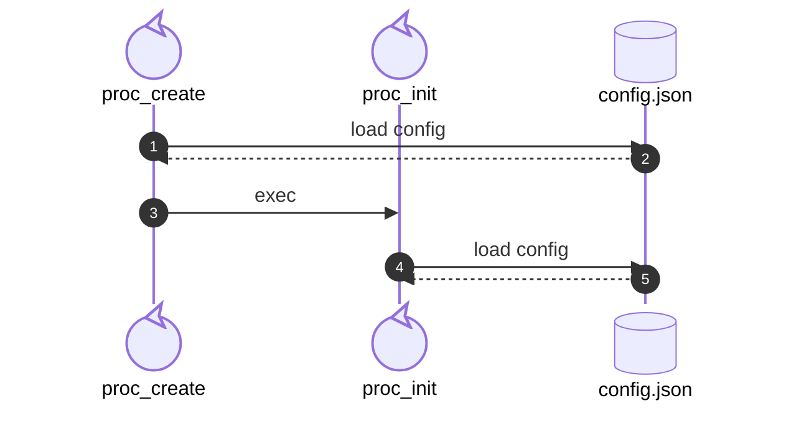
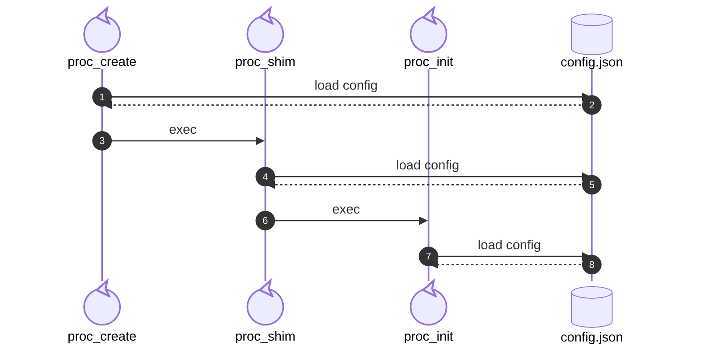

**目次**
* TOC
{:toc}

---

## OCI Configuration File(config.json)
OCI準拠のコンテナランタイムは、Configuration File(config.json)というコンテナ環境の設定ファイルに基づいて起動する動きになります。  
config.jsonには以下のようなパラメータが含まれています。  

- エントリポイント
- 環境変数
- 隔離対象名前空間
- Capability
- Seccomp

そのほかにも様々なパラメータがあります。詳細は[OCI Runtime Specification](https://github.com/opencontainers/runtime-spec/blob/main/config.md)を参照してみてください。  

config.jsonはコンテナの設計図であり、これを差し替えることができれば起動するコンテナを任意の環境で実行させることが可能になります。  
ここでは、RaindにおけるConfiuration Fileに対するセキュリティ対策について紹介します。

### TOCTOU攻撃
TOCTOU(Time-of-Check, Time-of-Use)とは、あるパラメータに対してチェックを行ったあと、そのパラメータを使うまでの間にパラメータを差し替えることで、チェック機構をバイパスすることで成功する攻撃手法です。  
RaindにおいてConfiguration Fileの読み込み/利用する箇所は以下になります。

1. createプロセス起動直後
2. initプロセス起動直後
3. shimプロセス起動直後

図に表すと以下です。

- create+initモデル


- create+shim+initモデル


各プロセスにおいてConfiguration Fileに基づいた処理が必要であり、すべてを各プロセスの引数で渡すことは現実的ではないため、それぞれのプロセスの開始直後にConfiguration Fileを読み込む設計になっています。  

このような起動フローの場合、

- createプロセス起動後～initプロセス開始前
- createプロセス起動後～shimプロセス開始前
- shimプロセス起動後～initプロセス開始前

にConfiguration Fileを差し替えれば、本来意図していた設定から逸脱したコンテナを起動することができます。  
特にinitプロセスはコンテナとしてのエントリポイントや環境変数、ファイルシステムのマウント等の重要な処理が走るため、ここで差し替えが発生してしまった場合かなり危険です。

```mermaid
sequenceDiagram
    autonumber
    participant proc_create@{ "type": "control" }
    participant proc_init@{ "type": "control" }
    participant config.json@{ "type": "database" }
    participant MaliciousUser@{ "type": "actor" }

    proc_create->>config.json: load config
    config.json-->>proc_create: 

    proc_create->>proc_init: exec

    rect rgb(66, 12, 12)
    note right of proc_init: ATTACK
    MaliciousUser->>config.json: inject malicious parameter

    proc_init->>config.json: load config
    config.json-->>proc_init:
    proc_init->>proc_init: exec Entrypoint
    note over proc_init: Malicious Entrypoint
    end
```



#### 対策
対策として、いずれのモデルにおいても共通しているのは"createプロセスで読み込んだConfiguration Fileで起動すること"です。※Configuration Fileの内容自体の検査は別で対策する前提。  

RaindではConfiguration Fileを読み込む際に、以下のような処理を行っています。

1. createプロセス
    1. Configuration FileのHash計算 *Hash#1
    2. 記録用ファイルへHash#1を記録 *Hash#2
    3. Configuration Fileの読み込み
    4. Configuration FileのHashを再度計算 *Hash#3
    5. Hash#1とHash#2の突合 (1.～2.間のTOCTOU対策)
    6. Hash#2とHash#3の突合 (2.～4.間のTOCTOU対策)
2. shimプロセス
    1. 記録用ファイルからHash値を読み込み *Hash#2
    2. Configuration FileのHash計算 *Hash#4
    3. Hash#2とHash#4の突合 (createプロセス～shimプロセス間のTOCTOU対策)
    4. Configuration Fileの読み込み
3. initプロセス
    1. 記録用ファイルからHash値を読み込み *Hash#2
    2. Configuration FileのHash計算 *Hash#5
    3. Hash#2とHash#5の突合 (create/shimプロセス～initプロセス間のTOCTOU対策)
    4. Configuration Fileの読み込み
    5. 記録用ファイルの削除

xxとyyの間に差し替えられたら？という発想は出てきますが、[ゼノンのパラドックス(アキレスと亀)](https://ja.wikipedia.org/wiki/%E3%82%BC%E3%83%8E%E3%83%B3%E3%81%AE%E3%83%91%E3%83%A9%E3%83%89%E3%83%83%E3%82%AF%E3%82%B9)みたく、チェックするタイミングと使うタイミングを完全に0にすることはできません。  
ポイントは、いかにチェックと使うまでの間隔を短くするか、チェック機構を増やし攻撃が成功しにくくなるか、です。  

この仕組みによって、攻撃者は

- Configuration Fileの書き換え
- 書き換え後のConfiguration FileのHash値計算と記録用ファイルへの書き込み

この2つを短時間で実行させる必要があるため、攻撃成功率は各段に下がります。

#### 動作確認: 対策前
まずはPoCとして上記の検証を実装しない状態で、initプロセスのConfiguration File読み込み前にsleepを組み込み、手動でConfiguration Fileを書き換えます。

まずはコンテナを作成します。
```bash
$ raind container create -t ubuntu
container: 01kfcmayge4v created
```
ここでinitプロセスはConfiguration Fileを読み込まず待機しているため、手動でConfiguration Fileを書き換えます。
今回はわかりやすくコンテナ起動時のディレクトリ位置(cwd)を書き換えます。
```bash
{
    "ociVersion": "1.3.0",
    "root": {
        "path": "/etc/raind/container/01kfcmayge4v/merged"
    },
    "mounts": [],
    "process": {
        // "cwd": "/",      <- original
        "cwd": "/home"  //  <- inject malicious parameter
```
書き換え後、コンテナを起動してアタッチします。
```bash
$ raind container start 01kfcmayge4v
container: 01kfcmayge4v started

$ raind container attach 01kfcmayge4v
Attached. Detach with Ctrl-P Ctrl-Q
root@01kfcmayge4v:/home# pwd
/home
```
コンテナ作成時点(createプロセス)で読み込んだConfiguration Fileは"/"がWDとして指定されていましたが、コンテナ開始時点(initプロセス)で読み込んだConfiguration Fileは"/home"に書き換わっており、起動したコンテナのWDが変わってしまっています。

#### 動作確認: 対策後
Configuration Fileの読み込みを[対策](#対策)に記載した処理にして再度試してみます。
起動と書き換えまでは同じです。
```bash
$ raind container create -t ubuntu
container: 01kfcmhkafsw created
```
```bash
// configuration file書き換え
{
    "ociVersion": "1.3.0",
    "root": {
        "path": "/etc/raind/container/01kfcmhkafsw/merged"
    },
    "mounts": [],
    "process": {
        // "cwd": "/",      <- original
        "cwd": "/home"  //  <- inject malicious parameter
```
ここで起動します。startコマンドは開始シグナルの送信のみのため、起動後にステータスを確認します。
```bash
$ raind container start 01kfcmhkafsw
container: 01kfcmhkafsw started

$ raind container ls
CONTAINER ID  IMAGE          COMMAND      CREATED        STATUS   PORTS
01kfcmhkafsw  ubuntu:latest  "/bin/bash"  1 minutes ago  stopped
```
コンテナが停止しているようです。ここで、ログを確認してみます。
```bash
$ cat /etc/raind/container/01kfcmhkafsw/logs/console.log
2026/01/20 11:43:37 config.json hash validation failed: expect=xxx, got=yyy
2026/01/20 11:43:37 container startup failed
```
Configuration FileのHash突合に失敗し、コンテナの起動ができていないことが確認できます。  
