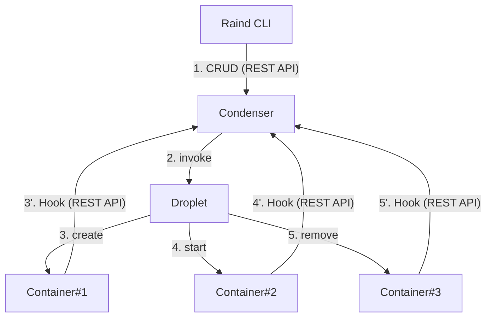
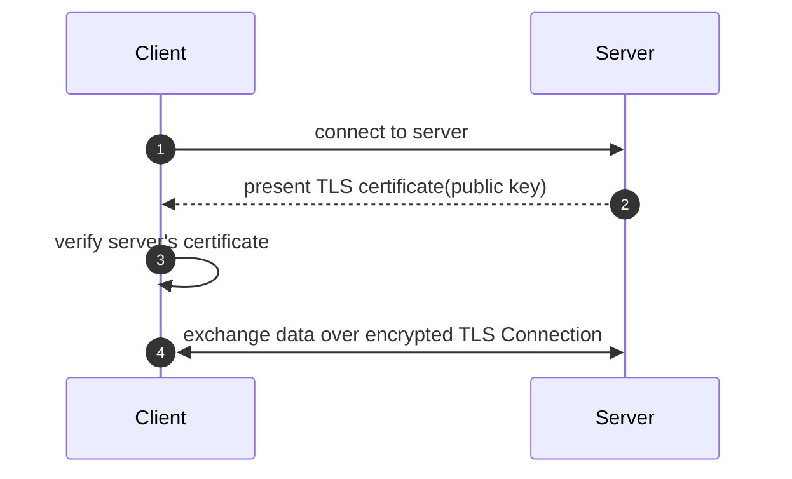
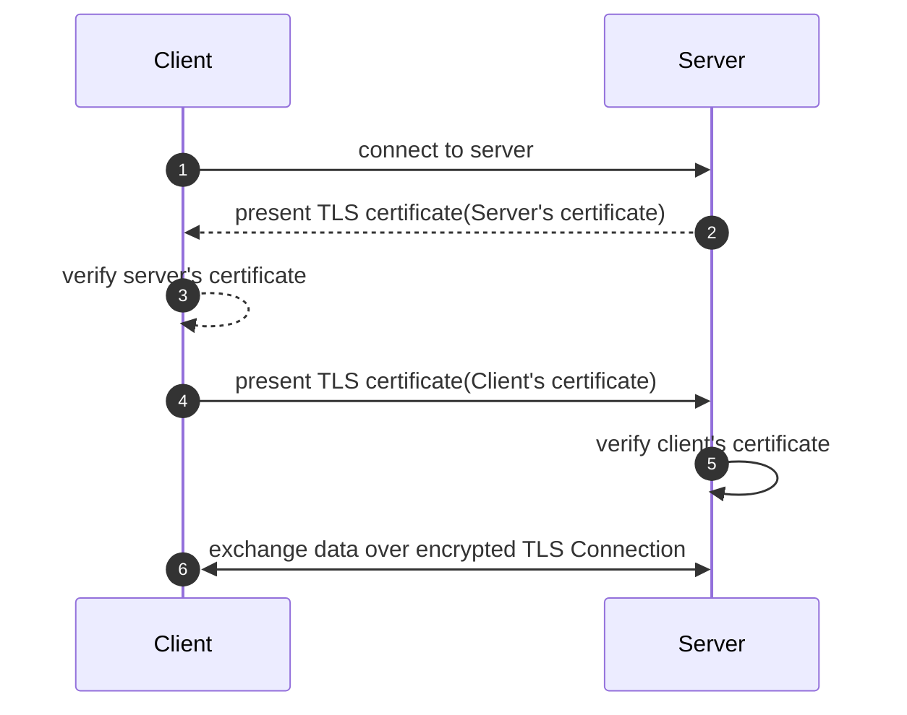

**目次**
* TOC
{:toc}

---

## コンテナランタイムにおける認証/認可
コンテナランタイムというと、プロセスや名前空間といったコンテナ自体のセキュリティに目が行きがちです。   
しかし、コンテナランタイムのセキュリティはそれらだけでなく、コンテナの作成や起動、停止といったオペレーションに対してもセキュリティ対策をする必要があります。   
ここでは、Raindにおける認証/認可がどのようなポイントに対する保護を行っているのか見ていきます。

## Raindにおける認証/認可の全体像
RaindはCondenser(高レベルコンテナランタイム)を中心として、多くのコミュニケーションがREST APIによる通信で構成されています。



Condenserはコンテナの起動/削除といった管理やポリシー操作Raindにおける中枢機能を担っているため、REST APIに対するアクセスができる=Raindの管理者と同等の権限を保持することになります。  
そこで、Raindでは **mTLS + SPIFFE** による認証/認可を行っています。  

今回は認証の実装について触れていきます。認可については[SPIFFEによる認可]({{ '_posts/spiffe' | relative_url }})にて紹介しています。

## mTLS (認証)
mTLS(Mutal TLS:相互TLS認証)とは、サーバ/クライアントが相互に認証を行ったうえで接続を確立するTLSハンドシェイクの方法です。 
通常のTLSは **クライアントがサーバを認証する** というのが主目的のハンドシェイクですが、mTLSの場合、

- クライアントがサーバを認証する
- サーバがクライアントを認証する

という双方向の認証を行います。

- TLS Handshake


TLSハンドシェイクの基本は、サーバが証明書(公開鍵)を提示しクライアントが証明書の妥当性をチェックする仕組みです。  
一方、mTLSの場合は以下のようになります。

- mTLS Handshake


サーバから証明書を受け取ったのち、**クライアントの証明書をサーバに提示** します。  
サーバはそのクライアント証明書の妥当性チェックを行った後、TLSを確立します。  

実装としては、REST APIサーバ起動時に

1. TLS設定として `RequireAndVerifyClientCert` を指定
2. クライアント証明書を発行したCAの証明書を指定

することで、mTLSが有効になります。

```go
	// == rest api ==
	clientCA, err := cert.LoadCertPoolFromFile(utils.ClientIssuerCACertPath)
	tlsCfg := &tls.Config{
		MinVersion: tls.VersionTLS13,                   // TLS Version
		ClientCAs:  clientCA,                           // Client Certificate's CA
		ClientAuth: tls.RequireAndVerifyClientCert,     // enable mTLS
	}

	// Management Server
	managementAddr := "127.0.0.1:7755"
	managementRouter := httpapi.NewApiRouter()
	if err != nil {
		log.Fatal(err)
	}
	managementSrv := &http.Server{
		Addr:      managementAddr,
		Handler:   managementRouter,
		TLSConfig: tlsCfg,
	}
    // start server
	go func() {
		log.Printf("[*] management server listening on %s", managementAddr)
		if err := managementSrv.ListenAndServeTLS(
            utils.PublicCertPath,   // server's public key
            utils.PrivateKeyPath,   // server's private key
        ); err != nil {
			log.Fatal(err)
		}
	}()
```

### 動作確認
mTLSを有効にしたREST APIエンドポイントに対して、クライアント証明書を提示せずにリクエストを送信してみます。

```
$ curl -v --cacert /etc/raind/cert/raind.crt https://localhost:7755/v1/containers

* Host localhost:7755 was resolved.
* IPv6: ::1
* IPv4: 127.0.0.1
*   Trying [::1]:7755...
    :
* Server certificate:
*  subject: CN=raind
*  start date: Jan 25 02:36:19 2026 GMT
*  expire date: Jan 24 03:36:19 2031 GMT
*  subjectAltName: host "localhost" matched cert's "localhost"
*  issuer: CN=raind
*  SSL certificate verify ok.
*   Certificate level 0: Public key type RSA (4096/152 Bits/secBits), signed using sha256WithRSAEncryption
* TLSv1.3 (IN), TLS alert, unknown (628):
* OpenSSL SSL_read: OpenSSL/3.0.13: error:0A00045C:SSL routines::tlsv13 alert certificate required, errno 0
* Failed receiving HTTP2 data: 56(Failure when receiving data from the peer)
* Connection #0 to host localhost left intact
```

TLS Alert: `certificate required` というエラーにより接続が拒否されています。  
データベースやAPI Gatewayといった、特定のユーザ/クライアントにのみアクセスを許可するようなサービスでは、mTLSを利用することで正規のクライアント証明書がないクライアントからのリクエストを防ぐことができます。  
