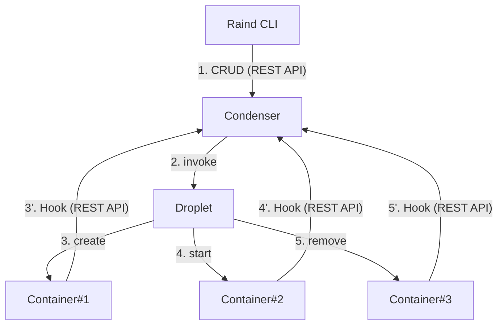
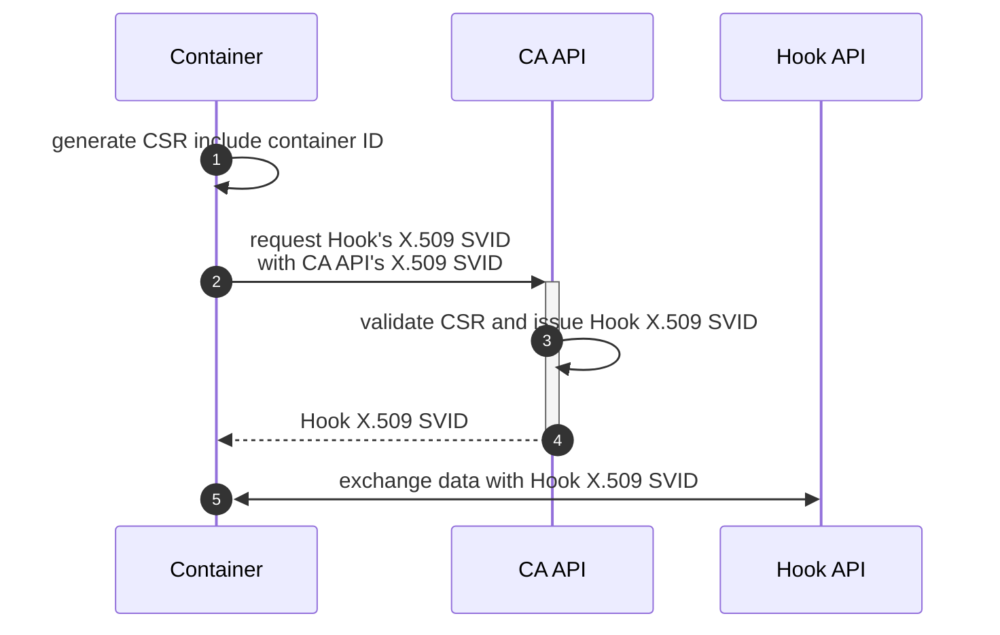

**目次**
* TOC
{:toc}

---

Raindにおける認証/認可のうち、今回は認可の実装について触れていきます。認証については[mTLSによる認証]({{ '_posts/mtls' | relative_url }})にて紹介しています。

## mTLSにおける認可の問題
mTLSの観点でいうアイデンティティとは"正規のクライアントかどうか"であり、この検証に証明書(X.509)を利用しています。  
しかしながら、”クライアント証明書の提示”というアイデンティティのみでは、以下のような問題があります。

- 証明書のCN/DNSを利用したユーザ識別は意味が曖昧
  - CommonName,DNSをユーザとして検証する、というのは直感的ではない
- IPアドレスを埋め込んでいた場合、IPアドレスの変化に弱い
- ホスト名による判断は脆弱
  - ホスト名は偽装が容易、ユーザ識別としてはセキュリティレベルが低い

特に、従来のクライアント証明書ではCNやSAN(DNS/IP)での識別が多くありますが、ユーザとしての意味や定義、証明書内での表現に規定がなかったため、

- 認証はできても認可が壊れやすい
- システムのコンポーネントが大きくなるほど、信頼関係が崩れやすい

という問題に繋がります。  
mTLSのみでは認可の実装が不十分な理由がここにあります。

## SPIFFE
そこでRaindでも利用しているのが、**SPIFFE** です。  
SPIFFEとは、Secure Production Indentity Framework For Everyoneの頭文字をとったもので、

> 分散システムにおいて、ワークロード自身に強い・検証可能なアイデンティティを与えるための枠組み

というものになります。  
特にポイントとなるのは **アイデンティティ** で、SPIFFEはこのアイデンティティの表現を定義した枠組み、という言い方もできます。

### 構成要素
SPIFFEには主に以下の4つの要素で構成されます。  

| 要素 | 役割 |
|:---- | :-- |
| Trust Domain | 信頼の境界 |
| SPIFFE ID | ワークロードの論理ID |
| SVID | SPIFFE IDを検証可能な形で包んだもの |
| Workload API | SPIFFE ID配布の仕組み |

それぞれどのようなものか見ていきます。

#### Trust Domain
Trust Domainとは、

> ワークロードを含むコンポーネント全体の範囲であり、Trust Domainの範囲では同一のポリシー/意味付けによって動作する

という最上位の信頼境界です。  
具体的にTrust Domainが決めるものは以下の3つです。

1. 誰がSPIFFE IDを発行する権限を持つか
2. SPIFFE IDの意味論
3. 認可ポリシーの適用範囲

これを決めることで、

> Trust Domainが違う = SPIFFE IDの意味も役割も認可ルールも共有されない

という扱いができるようになります。  
もう少し実装目線で言うと、"Trust Domain独自のポリシーで認可システムを構築することが可能"となります。

#### SPIFFE ID
SPIFFE IDとは、

> ワークロードが何者として振舞うか

を表す論理IDです。  
先ほどからワークロードと出てきていますが、ワークロードとはそのシステムを利用するコンポーネントのことです。  
そのシステムを利用する人、システム内でそれを利用する別のシステムも、ワークロードです。  

SPIFFE IDはURI形式で表現されます。
```
spiffe://<trust-domain>/<path>
```
URI形式ですが、SPIFFE IDが表しているのはホストでもIPでもなく、**役割+所属+識別子の合成** です。

例えば、

- Trust Domain: API Gatewayにおいて
- Management APIを利用するシステムのうち
- 管理者権限を持つワークロード

を表したい場合、

```
spiffe://api-gateway/management/admin
```

というような表現ができます。  
SPIFFE IDに含まれるpathはTrust Domain毎の独自ポリシーで自由に定義してよいため、上記のような構成である必要はありません。  
ポイントは、**SPIFFE IDが意味のある文字列となっていること** です。

また、SPIFFE IDはSPIFFEにおける **アイデンティティそのもの** であり、Trust Domain内のシステムでは同一のポリシーでもってSPIFFE IDを検証することになります。

#### SVID
SVIDとはSPIFFE Verifiable Identity Documentの頭文字を取ったもので、文字通り

> SPIFFE IDを検証可能な形で包んだもの

です。  
SPIFFE ID自体は文字列なので、jsonデータに組み込んだりHTTPヘッダに含めたりした場合は、それらがSVIDということになります。  
ただし、現時点でSPIFFEとしてサポートしているのは

- X.509
- JWT

の2つのみです。  
特にX.509 SVIDはmTLSと相性が良く、mTLSで利用するクライアント証明書内にSPIFFE IDを組み込むだけで、既存のシステムにSPIFFEを導入することが可能になります。※認可のシステム拡張等は除いて

#### Workload API
Workload APIとは、

> ワークロードが安全に自分のSVIDを取得する方法

です。  
APIという単語からREST APIやWeb APIのようなものをイメージしてしまいますが、ここでのAPIとは**仕組み**のことを指しています。つまり、仕様であり実装は自由、ということになります。  
例えばあるTrust Domainでは "共有フォルダにSVIDを設置しクライアントがそれをダウンロードする" という方法としたのであれば、これがWorkload APIです。

### RaindにおけるSPIFFE
[mTLSによる認証]({{ '_posts/mtls' | relative_url }})でも記載したとおり、Raindは以下のようにREST APIを利用したコミュニケーションを実装しています。



RaindのREST APIには大きく分けて3つのエンドポイントがあります。

1. Control Plane API
  - コンテナ管理やイメージ管理といった管理操作を行うエンドポイント
2. Hook API
  - コンテナとCondenserのステータス同期等を行うエンドポイント
3. Certificate Authority API
  - X.509 SVIDを発行するためのエンドポイント = Workload API

そこで、SPIFFE IDを各エンドポイントに対し以下のように定義しています。

| エンドポイント | Trust Domain | Role | ID | SPIFFE ID |
|:------------- |:----------- |:----- |:-- |:--------- |
| Control Plane API | raind | cli | admin | spiffe://raind/cli/admin |
| Hook API | raind | hook | \<container-id> | spiffe://raind/hook/\<container-id> |
| CA(Certificate Authority) API | raind | droplet | container | spiffe://raind/droplet/container |

各エンドポイントはSPIFFE IDを検証し、上記にマッチしないワークロードからの接続は拒否する実装としています。

#### SPIFFE ID実装#1: Trust DomainおよびRoleの検証
各エンドポイントにおいて、一つ目の検証としてTrust DomainとRoleの検証を行います。  
実装としては、RouterのMiddlewareにSPIFFE ID検証を組み込みます。

```go
func NewApiRouter() *chi.Mux {
  r := chi.NewRouter()
    :

  // middleware
  r.Use(middleware.RequestID)
  r.Use(middleware.Logger)
  r.Use(middleware.Recoverer)
  r.Use(RequireSPIFFE("spiffe://raind/cli/"))   // Allowed SPIFFE Trust Domain and Role

  // == v1 ==
  // == containers ==
  r.Get("/v1/containers", containerHandler.GetContainerList)
    :
  return r
}

func RequireSPIFFE(prefix string) func(http.Handler) http.Handler {
  return func(next http.Handler) http.Handler {
    return http.HandlerFunc(func(w http.ResponseWriter, r *http.Request) {
      if r.TLS == nil || len(r.TLS.PeerCertificates) == 0 {
        http.Error(w, "client certificate required", http.StatusUnauthorized)
        return
      }
      // validate
      cert := r.TLS.PeerCertificates[0]
      spiffeId := cert.URIs[0]
      if strings.HasPrefix(spiffeId.String(), prefix) {
        next.ServeHTTP(w, r)
        return
      }
      http.Error(w, "forbidden", http.StatusForbidden)
    })
  }
}
```

提示される証明書に含まれるSPIFFE ID(URI)が、そのエンドポイントに対して許可しているTrust DomainおよびRoleかどうかを判断しています。  
SPIFFE IDがURI形式なのは、strings.HasPrefix() のような文字列検証でも認可が行えるため、という側面があります。

##### 動作テスト
試しにCA API用のクライアント証明書(=X.509 SVID)を利用してControl Plane APIに対してリクエストを行ってみます。
CA API用証明書の内容は以下のようになっています。

```x509
Certificate:
    Data:
        Version: 3 (0x2)
        Serial Number:
            31:71:8f:47:f6:47:c1:97:0a:81:4f:c7:78:0d:f8:e0
        Signature Algorithm: sha256WithRSAEncryption
        Issuer: CN = raind client issuer
            :
        X509v3 extensions:
            X509v3 Key Usage: critical
                Digital Signature
            X509v3 Extended Key Usage: 
                TLS Web Client Authentication
            X509v3 Basic Constraints: critical
                CA:FALSE
            X509v3 Authority Key Identifier: 
                55:D8:E3:BB:5F:7B:69:B2:CD:C7:91:47:F9:14:27:4A:48:9F:33:74
            X509v3 Subject Alternative Name: 
                URI:spiffe://raind/droplet/container
```

`X509v3 Subject Alteernative Name(SAN)`のURIに、`spiffe://raind/droplet/container` が含まれていることがわかります。
それではリクエストしてみます。

```
$ curl -v https://localhost:7755/v1/containers --cacert <condenser's cert> --cert <cert for CA API> --key <key for CA API>

* Host localhost:7755 was resolved.

    :

* TLSv1.3 (IN), TLS handshake, Server hello (2):
* TLSv1.3 (IN), TLS handshake, Encrypted Extensions (8):
* TLSv1.3 (IN), TLS handshake, Request CERT (13):
* TLSv1.3 (IN), TLS handshake, Certificate (11):
* TLSv1.3 (IN), TLS handshake, CERT verify (15):
* TLSv1.3 (IN), TLS handshake, Finished (20):
* TLSv1.3 (OUT), TLS change cipher, Change cipher spec (1):
* TLSv1.3 (OUT), TLS handshake, Certificate (11):
* TLSv1.3 (OUT), TLS handshake, CERT verify (15):
* TLSv1.3 (OUT), TLS handshake, Finished (20):

    :

* TLSv1.3 (IN), TLS handshake, Newsession Ticket (4):
< HTTP/2 403 
< content-type: text/plain; charset=utf-8
< x-content-type-options: nosniff
< content-length: 10
* Connection #0 to host localhost left intact
```

無事にアクセスが拒否されました。そのうえで、上記の結果でポイントとなる点は2つです。

1. TLS Handshakeは確立している  
    Raind(Trust Domain)におけるX.509 SVIDの発行者は1つとしているため、クライアント証明書の発行者も同一となります。  
    そのため、mTLSにおける認証は正常=TLS Handshakeは問題なく確立できます。

2. Status Code: 403 Forbiddenとなっている  
    許可するSPIFFE IDである`spiffe://raind/cli`ではないSPIFFE IDからのリクエストが来たため、  
    アクセス拒否=403 Forbiddenで通信を拒否している。

SPIFFE IDを利用することで認証=OK, 認可=NGの仕組みを構築することができています。

#### SPIFFE実装#2: Workload API
Raindでは **コンテナもワークロードの1つ** として取り扱います。  
そのためコンテナ起動時に以下の流れでSVIDの発行を行っています。



CA APIを利用するためのX.509 SVIDについては、Raind内で共通のものを利用しています。(いわゆるブートストラップ問題、OTP等でも実装可)  
そのうえで、CA APiは受け取ったCSRの整合性チェック、特にCondenserで作成している正規のContainer IDかどうかのチェックを行ったうえで、Hook用 X.509 SVIDを発行します。  
このフロー全体がRaindにおけるWorkload APIとなっています。

#### SPIFFE実装#3: ID検証と失効
上記に記載した流れからわかるとおり、Raindでは**1コンテナ:1SPIFFE**という紐づけが行えます。  
Hookの主な用途としてはCondenser側とのコンテナステータス同期が目的(詳細は[コンテナステータスの同期]({{ '_posts/status_sync' | relative_url }})を参照)ですが、この紐づきにより

- 受信したHook通信は1つのコンテナにのみ紐づく
- あるコンテナが別のコンテナに偽装してHookを行うことを防ぐ
- コンテナ削除時はそのSPIFFE ID(X.509 SVID)が無効となる  
= コンテナライフサイクルとSPIFFE IDライフサイクルが同期している

という認可のフローを組み込むことが可能になります。  
実装としては、認証後およびTrust Domain/Role検証後の処理に以下を追加しています。

```go
func (h *RequestHandler) validateSpiffe(r *http.Request, state hook.ServiceStateModel) (bool, error) {
  cert := r.TLS.PeerCertificates[0]
  for _, uri := range cert.URIs {
    u, err := url.Parse(uri.String())
    if err != nil {
      return false, fmt.Errorf("invalid format: %s", uri)
    }

    // validate scheme
    if u.Scheme != "spiffe" {
      return false, fmt.Errorf("invalid scheme: %s", u.Scheme)
    }
    // validate domain
    if u.Host != "raind" {
      return false, fmt.Errorf("invalid domain: %s", u.Host)
    }

    // retrieve container id
    path := strings.TrimPrefix(u.Path, "/")
    parts := strings.Split(path, "/")
    if len(parts) != 2 || parts[0] != "hook" {
      return false, fmt.Errorf("invalid spiffe path: %s", path)
    }
    containerId := parts[1]
    if containerId == "" {
      return false, errors.New("container id empty")
    }

    // validate container id
    // check if the spiffe's id and state's id is same
    if containerId != state.Id {
      return false, fmt.Errorf("SPIFFE ID did not match the state ID: spiffe=%s, state=%s", containerId, state.Id)
    }
    // check if the spiffe's id exist
    if ok := h.csmHandler.IsContainerExist(containerId); !ok {
      return false, fmt.Errorf("container: %s not found", containerId)
    }
  }
  return true, nil
}
```

念のためここでもTrust Domain/Roleの検証をしつつ、

- コンテナステータスとSPIFFE IDが一致していることの検証
- `IsContainerExist()` でSPIFFE IDと紐づくコンテナが存在していることの検証

これらID検証を追加で行います。  

※１つ目のコンテナステータスについては、Hook通信にはコンテナのステータス情報であるstate.jsonが渡される仕様であるため、これを利用した検証となります。  
(これは[OCIにて定義](https://github.com/opencontainers/runtime-spec/blob/main/config.md#posix-platform-hooks)されているHookに基づいています。)  


##### 動作テスト
試しに以下2パターンのシチュエーションを想定した動作テストを行います。

1. Hookを利用した操作対象のContainer IDとSPIFFE IDが異なる場合
2. すでに削除済みのコンテナ用X.509 SVIDを利用した場合

いずれもRaind全体のコンテナ環境を破壊するための悪意のあるユーザにより行われた想定としています。


**１．Hookを利用した操作対象のContainer IDとSPIFFE IDが異なる場合**

偽装したstate.jsonまたはX.509 SVIDを送信した場合にアクセスが拒否されることを確認してみます。

利用するX.509 SVIDには以下のSPIFFE IDが埋め込まれているとします。
```
spiffe://raind/hook/<container#A's ID>
```

```
$ curl -v -X POST https://localhost:7756/v1/hooks/droplet --cacert <raind ca cert> --cert <contaner#A's X.509 SVID> --key <container#A's X.509 SVID> -d '{"id": "invalid-id"}'

    :
* TLSv1.3 (IN), TLS handshake, Newsession Ticket (4):
< HTTP/2 403 
< content-type: application/json
< content-length: 123
< date: Mon, 26 Jan 2026 08:38:31 GMT

{"status":"fail","message":"validate failed: SPIFFE ID did not match the state ID: spiffe=<container#A's ID>, state=invalid-id"}
```

403 Forbiddentとともに、`validate failed: SPIFFE ID did not match` というエラーが返ってきました。  
これによって、state.json(情報)とX.509 SVID(情報送信者=ワークロード)が一致していることが担保されるようになります。

**２．すでに削除済みのコンテナ用X.509 SVIDを利用した場合**

コンテナ稼働中にX.509 SVIDが漏洩したためそのコンテナを削除したのち、そのX.509 SVIDが利用できないことを確認してみます。


```
$ curl -v -X POST https://localhost:7756/v1/hooks/droplet --cacert <raind ca cert> --cert <contaner#A's X.509 SVID> --key <container#A's X.509 SVID> -d '{"id": "container#A's ID"}'

    :
* TLSv1.3 (IN), TLS handshake, Newsession Ticket (4):
< HTTP/2 403 
< content-type: application/json
< content-length: 81
< date: Mon, 26 Jan 2026 09:04:24 GMT
< 
{"status":"fail","message":"validate failed: container: <container#A's ID> not found"}
```

403 Forbiddenとともに、`validate failed: container: <container#A's ID> not found` というエラーが返ってきました  
これによって、万が一X.509 SVIDが漏洩した場合でも即座にそのX.509 SVIDを失効させることが可能になります。これはコンテナという起動/削除のライフサイクルが早いコンポーネントとの相性が非常に良い点です。
